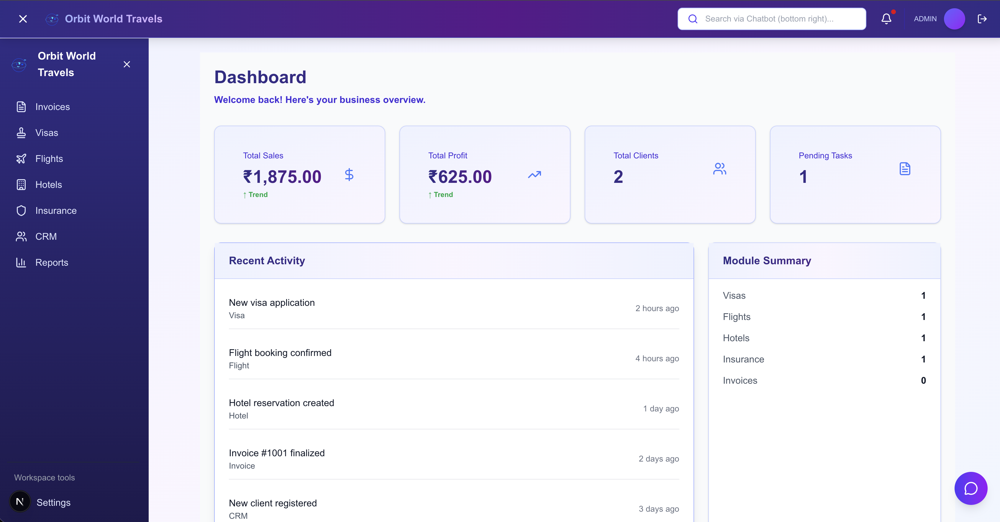
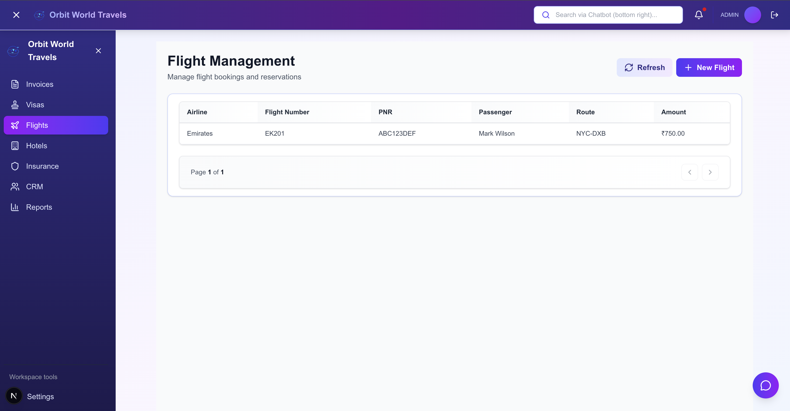
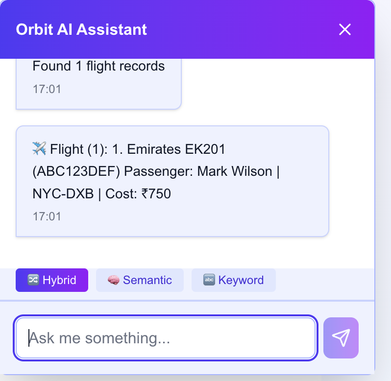

# 🚀 Orbit World Travels

A production-grade **Travel Operations Management Platform** built to streamline bookings, invoicing, and customer management for travel agencies — enhanced with AI-powered automation.

---

## 🔥 Highlights

* 🧾 End-to-end invoice management with margin tracking
* ✈️ Multi-module system (Visa, Flight, Hotel, Insurance, CRM)
* 🤖 AI chatbot with semantic + keyword search
* 📄 Document-based invoice generation (LLM-powered)
* 📊 Real-time analytics and reporting

---

## 🌐 Live Demo

Live Application:
https://orbitworld.ddns.net

Demo Credentials:
Email: [demo@orbitworld.com](mailto:demo@orbitworld.com)
Password: Demo123!

Note:
Demo account has restricted read-only access intended for recruiter and portfolio evaluation purposes.

---

## 🎯 Use Case

Designed for travel agencies to:

* Manage complete booking lifecycle across services
* Track profitability and margins in real time
* Automate invoice creation from documents
* Query operational data using natural language

This platform represents a **real-world internal SaaS system** used by travel operators.

---

## 📸 Screenshots

### Dashboard

Real-time overview of bookings, revenue, and operations.


### Flight Management

Track PNR, passengers, and ticket uploads.


### AI Chat Assistant

Query travel data using natural language.


---

## 🧠 Why This Project Stands Out

* Built as a **real-world SaaS product**, not a demo
* Combines **AI + traditional CRUD systems**
* Implements **hybrid search (Vector + BM25)**
* Designed with **scalability and modular architecture**

---

## 🛠️ Tech Stack

| Layer              | Technologies                                              |
| ------------------ | --------------------------------------------------------- |
| **Frontend**       | Next.js, React, TypeScript, Tailwind CSS, Zustand         |
| **Backend**        | Node.js, Express, TypeScript, MongoDB, Mongoose           |
| **Authentication** | JWT-based, Role-Based Access Control (RBAC)               |
| **AI/ML**          | Groq LLM (LLaMA 3), Document Processing, Query Generation |
| **DevOps**         | Docker, Docker Compose                                    |

---

## 🚀 Quick Start

### Prerequisites

* Node.js (v18+)
* MongoDB (local or cloud)
* npm (v8+)
* Groq API Key

---

### Local Development

#### Backend

```bash
cd backend
npm install
npm run dev
```

#### Frontend

```bash
cd frontend
npm install
npm run dev
```

**Frontend uses environment-based API configuration:**
- **Local Development:** `http://localhost:3008/api/orbit-world` (from `.env.local`)
- **Production:** Azure backend URL (from `.env.production`)
- See [REFACTORING_COMPLETE.md](REFACTORING_COMPLETE.md) for details

---

### Access

* Frontend: http://localhost:8008
* Backend: http://localhost:3008
* Health: http://localhost:3008/health

---

## 🐳 Docker Deployment

```bash
docker-compose up -d
```

---

## 📂 Project Structure

```
orbit-world-travels/
├── backend/
├── frontend/
├── docker-compose.yml
├── README.md
```

---

## 🔒 Environment Variables

### Backend Environment Variables
```env
# Database
MONGODB_URI=your_mongodb_connection_string

# Authentication
JWT_SECRET=your_jwt_secret_key
JWT_EXPIRES_IN=7d

# AI/LLM
GROQ_API_KEY=your_groq_api_key

# Server
PORT=3008
NODE_ENV=development
```

### Frontend Environment Variables
The frontend uses environment-based API configuration:

**Local Development** (`.env.local`):
```env
NEXT_PUBLIC_API_BASE_URL=http://localhost:3008/api/orbit-world
NEXT_PUBLIC_ENVIRONMENT=development
```

**Production** (`.env.production`):
```env
NEXT_PUBLIC_API_BASE_URL=https://your-azure-backend-url/api/orbit-world
NEXT_PUBLIC_ENVIRONMENT=production
```

**See:** [REFACTORING_COMPLETE.md](REFACTORING_COMPLETE.md) for environment configuration details.

---

## ⚙️ API Configuration

The frontend is configured to support:
- ✅ **Local Development:** Automatically uses `http://localhost:3008`
- ✅ **Production Deployment:** Uses environment variable for custom backend URL
- ✅ **Docker Deployment:** Build arguments for custom configuration
- ✅ **CI/CD Integration:** GitHub Actions, Azure DevOps, etc.

**For complete API configuration details and deployment guide:**
→ See [DEPLOYMENT_GUIDE.md](DEPLOYMENT_GUIDE.md)

---

## 🚢 Cloud Readiness

* Azure App Service / Container Instances
* AWS (ECS / Fargate / Elastic Beanstalk)
* Vercel (Frontend only)
* Railway / Render (Backend)
* Docker for all deployments

**Deployment instructions:** See [DEPLOYMENT_GUIDE.md](DEPLOYMENT_GUIDE.md)

---

## ✅ Deployment Checklist

* ✅ Backend environment variables configured (JWT, MongoDB, Groq API)
* ✅ Frontend environment variables configured (NEXT_PUBLIC_API_BASE_URL)
* ✅ Backend running on port 3008
* ✅ Frontend API pointing to correct backend endpoint
* ✅ APIs tested and working
* ✅ Docker images built successfully
* ✅ Secrets secured (never commit `.env.production`)
* ✅ Documentation reviewed

**For complete deployment guide:** See [DEPLOYMENT_GUIDE.md](DEPLOYMENT_GUIDE.md)

---

## 👨‍💻 Author

Shaik Rahaman

---

## 📝 License

© 2024 Orbit World Travels
